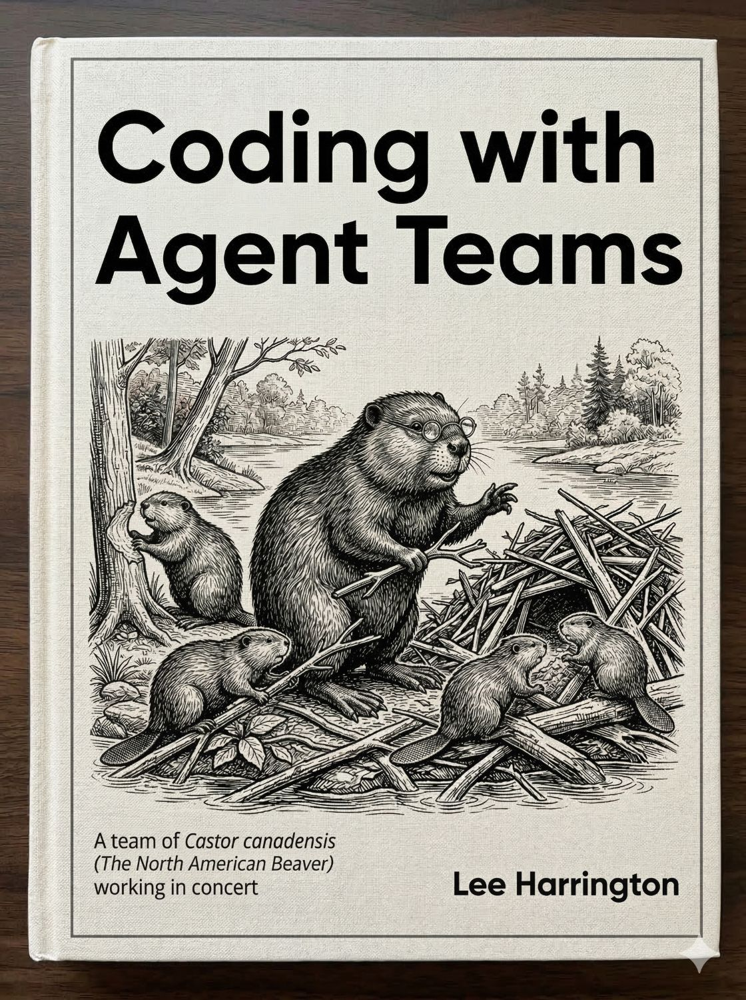

# AI Coding Books by Lee Harrington

A series of hands-on guides for developers working with AI tools. Each book is self-contained and builds directly on real practice — no toy examples, no hype.

---

## Book 1: The AI-Era Developer


> A hands-on guide to software engineering discipline in the age of AI coding tools.

**Thesis**: Software engineering discipline does not disappear in the AI era. It moves up a level. The AI writes the code. You are responsible for everything the code is supposed to do.

AI coding tools are powerful. Most developers using them are frustrated — because they gave up engineering discipline when they picked up the AI. This book restores that discipline, chapter by chapter, through real exercises using the AgentFlow methodology.

### Book Structure

**Part 1 — Engineering in the AI Era**

The reader builds a **personal task manager CLI** from scratch across all seven chapters. Each chapter introduces one SE principle through a hands-on scenario.

| Ch | Title | Principle |
|----|-------|-----------|
| 1 | [Plan Before You Prompt](chapters/part-1/ch-01-plan-before-you-prompt.md) | Plan before you prompt |
| 2 | [Define Requirements](chapters/part-1/ch-02-define-requirements.md) | Define requirements before you build |
| 3 | [Test AI Output](chapters/part-1/ch-03-test-ai-output.md) | Test what the AI produces |
| 4 | [Review Like a PR](chapters/part-1/ch-04-review-like-a-pr.md) | Review AI output like a colleague's PR |
| 5 | [Iterate Deliberately](chapters/part-1/ch-05-iterate-deliberately.md) | Iterate deliberately, not randomly |
| 6 | [Manage Scope](chapters/part-1/ch-06-manage-scope.md) | The AI will gold-plate if you let it |
| 7 | [Document Decisions](chapters/part-1/ch-07-document-decisions.md) | Document decisions, not just code |

**Part 2 — The AgentFlow Methodology**

For every principle from Part 1, Part 2 introduces the AgentFlow mechanism that enforces it systematically.

| Ch | Title | Mechanism |
|----|-------|-----------|
| 8 | [The AgentFlow Loop](chapters/part-2/ch-08-the-agentflow-loop.md) | The five-stage loop |
| 9 | [Skills and Autonomy Modes](chapters/part-2/ch-09-skills-and-autonomy-modes.md) | Skill system + three autonomy modes |
| 10 | [Context Files and Handoffs](chapters/part-2/ch-10-context-files-and-handoffs.md) | Document system for session continuity |
| 11 | [Multi-Agent Coordination](chapters/part-2/ch-11-multi-agent-coordination.md) | Parallel agents, merge review |
| 12 | [The Sprint Cadence](chapters/part-2/ch-12-the-sprint-cadence.md) | Sprint planning and execution |
| 13 | [Autonomy at Scale](chapters/part-2/ch-13-autonomy-at-scale.md) | Calibration heuristics, right mode for the task |
| 14 | [Putting It All Together](chapters/part-2/ch-14-putting-it-all-together.md) | Self-directed sprint, full system synthesis |

### Download Book 1

| Format | File |
|--------|------|
| 📖 EPUB | [AgentFlow.epub](chapters/AgentFlow.epub) |
| 📝 Word (DOCX) | [AgentFlow.docx](chapters/AgentFlow.docx) |
| 📄 PDF | [AgentFlow.pdf](chapters/AgentFlow.pdf) |

---

## Book 2: Coding with Agent Teams



> A practical guide to document-driven multi-agent coordination.

**Thesis**: A single agent has one context, one perspective, and one job. Complex work has structural properties one agent cannot satisfy. The solution is a team.

This book teaches you to build and run teams of AI agents — specialized roles working in sequence, passing structured output between each other, coordinated by a skill file you design. No external orchestration infrastructure required. Everything runs in your AI tool of choice using documents and skill files as the coordination layer.

**Part 1** builds a content pipeline: a team that takes a topic and produces a finished article. Researcher, Writer, Adversarial Reader, Coordinator. In Chapter 5 you compare the pipeline output against a single-prompt article. The difference is not subtle.

**Part 2** applies the same pattern to software development. Planner, Implementer, Reviewer, Tester, Documenter — coordinated through a feature-sprint skill. The project is `git-summary`, a CLI tool built from requirement to documented, tested code.

### Book Structure

**Part 1 — The Content Pipeline**

| Ch | Title | What You Build |
|----|-------|----------------|
| 1 | [Run the Prompt](book2/chapters/part-1/ch-01-run-the-prompt.md) | Baseline single-agent article |
| 2 | [The Grounding Problem](book2/chapters/part-1/ch-02-the-grounding-problem.md) | `agents/researcher.md` |
| 3 | [The Reader Problem](book2/chapters/part-1/ch-03-the-reader-problem.md) | `agents/adversarial-reader.md` |
| 4 | [Voice and Sequence](book2/chapters/part-1/ch-04-voice-and-sequence.md) | `skills/voice.md`, `skills/article-pipeline.md` |
| 5 | [Run the Pipeline](book2/chapters/part-1/ch-05-run-the-pipeline.md) | Full pipeline run + comparison |
| 6 | [What You Cannot Trust](book2/chapters/part-1/ch-06-what-you-cannot-trust.md) | Calibration and trust boundaries |

**Part 2 — The Coding Pipeline**

| Ch | Title | What You Build |
|----|-------|----------------|
| 7 | [Translating the Pattern](book2/chapters/part-2/ch-07-translating-the-pattern.md) | `requirement.md`, pattern map |
| 8 | [The Coding Team](book2/chapters/part-2/ch-08-the-coding-team.md) | Five agent role files |
| 9 | [The Feature Skill](book2/chapters/part-2/ch-09-the-feature-skill.md) | `skills/feature-sprint.md` |
| 10 | [Running a Sprint](book2/chapters/part-2/ch-10-running-a-sprint.md) | Full sprint run for `git-summary` |
| 11 | [Your Coding Team at Work](book2/chapters/part-2/ch-11-your-coding-team-at-work.md) | Calibration and what comes next |

### Download Book 2

| Format | File |
|--------|------|
| 📖 EPUB | [coding-with-agent-teams.epub](book2/coding-with-agent-teams.epub) |
| 📝 Word (DOCX) | [coding-with-agent-teams.docx](book2/coding-with-agent-teams.docx) |
| 📄 PDF | [coding-with-agent-teams.pdf](book2/coding-with-agent-teams.pdf) |

---

## Book 3: Your Dev Environment


> A Guide for AI-Assisted Developers.

**Thesis**: Before you can direct an AI coding tool effectively, you need to understand the environment it's operating in. Git, GitHub, Python environments, Node/npm, and your terminal are not optional prerequisites — they are the ground the AI stands on.

This book teaches new developers just enough about each layer of the environment to understand what their AI coding tool is doing — and direct it confidently when something breaks. No prior experience assumed. No toy examples. Every topic introduced through a real error or a real question the AI raises.

### Book Structure

**Introduction + Part 1 — Git & GitHub**

| Ch | Title |
|----|-------|
| Intro | Why Your Environment Matters |
| 1 | What Git Actually Is |
| 2 | GitHub — Where Your Code Lives |
| 3 | Getting Your Computer Authorized |
| 4 | Branches and Worktrees |
| 5 | When Git Goes Wrong |

**Part 2 — Python Environments**

| Ch | Title |
|----|-------|
| 6 | Why Python Has an Environment Problem |
| 7 | venv, conda, uv — Which One and Why |
| 8 | Reading requirements.txt and pyproject.toml |

**Part 3 — Node and npm**

| Ch | Title |
|----|-------|
| 9 | What Node Is (and Why It's on Your Machine) |
| 10 | nvm and Node Versions |
| 11 | package.json and node_modules |

**Part 4 — Warp**

| Ch | Title |
|----|-------|
| 12 | The Gap Warp Fills |
| 13 | Warp Basics |
| 14 | Warp Workflows for Developers |
| 15 | Dividing Responsibilities |

**Conclusion**

### Download Book 3

| Format | File |
|--------|------|
| 📖 EPUB | [your-dev-environment.epub](ai-env-book/your-dev-environment.epub) |
| 📝 Word (DOCX) | [your-dev-environment.docx](ai-env-book/your-dev-environment.docx) |
| 📄 PDF | [your-dev-environment.pdf](ai-env-book/your-dev-environment.pdf) |

---

## Target Reader

- **Book 1** — Working developers (2–10 yrs) who want to restore software engineering discipline to their AI-assisted workflow.
- **Book 2** — Developers who have outgrown single-agent sessions and want to coordinate multi-agent teams without external infrastructure.
- **Book 3** — New developers (or developers new to a stack) who need to understand the environment before they can direct an AI tool effectively.

---

## Repository Structure

```
├── chapters/               # Book 1: The AI-Era Developer
│   ├── part-1/             # Ch 1–7: SE principles
│   ├── part-2/             # Ch 8–14: AgentFlow methodology
│   ├── AgentFlow.epub
│   ├── AgentFlow.docx
│   └── AgentFlow.pdf
│
├── book2/                  # Book 2: Coding with Agent Teams
│   ├── chapters/
│   │   ├── part-1/         # Ch 1–6: Content pipeline
│   │   └── part-2/         # Ch 7–11: Coding pipeline
│   ├── coding-with-agent-teams.epub
│   ├── coding-with-agent-teams.docx
│   ├── coding-with-agent-teams.pdf
│   ├── coding-with-agent-teams.md  # Combined publication source
│   ├── harness-inventory.md        # 23 swap points for spin-offs
│   └── cover.jpg
│
├── ai-env-book/            # Book 3: Your Dev Environment
│   ├── chapters/           # 17 source chapter files
│   ├── your-dev-environment.md   # Combined publication source
│   ├── your-dev-environment.epub
│   ├── your-dev-environment.docx
│   ├── your-dev-environment.pdf
│   └── DevEnvCover.png
│
├── skills/                 # AgentFlow skill definitions
├── agents/                 # Agent role definitions (Book 1)
├── AGENTS.md               # Agent operating instructions
├── CLAUDE.md               # Project instructions for AI sessions
└── context.md              # Series session working memory
```

---

## Writing Methodology

All three books were written using **AgentFlow** — the same documentation-driven methodology they teach. The writing pipeline uses:

- A coordinator skill with defined stages (research, draft, adversarial read, revise)
- Specialized agent roles: se-educator, scenario-designer, confused-beginner, continuity-editor, agentflow-architect
- A book-voice skill enforcing consistent peer-to-peer tone across all sessions
- For Book 3: Claude Code parallel subagents (Parts written simultaneously, then merged)

---

*Book 1: "The AI-Era Developer" — complete*
*Book 2: "Coding with Agent Teams" — complete*
*Book 3: "Your Dev Environment" — first draft complete, editing in progress*
